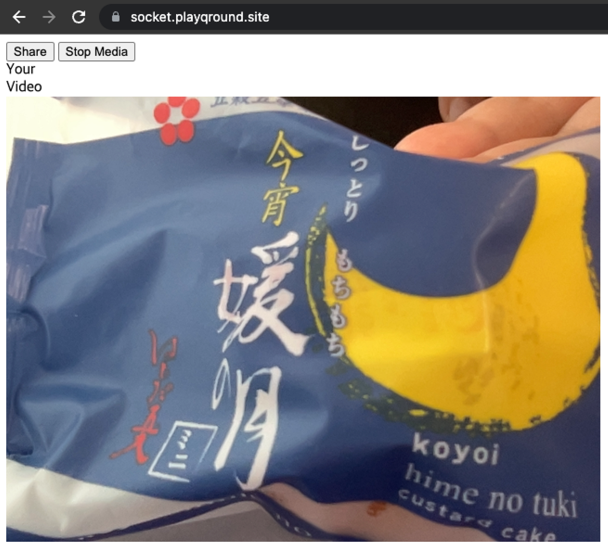
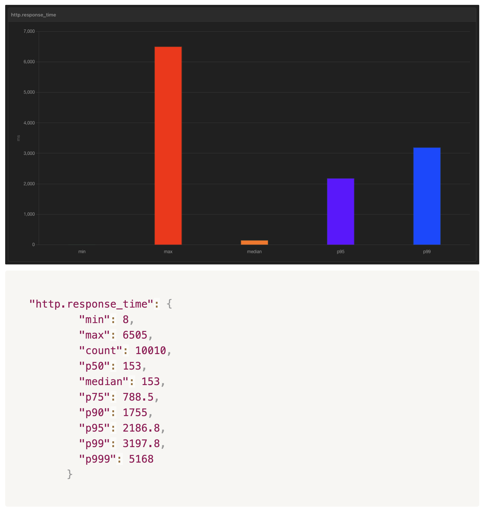

# PLAYQROUND

# 목차

### 1. [프로젝트 소개](#-프로젝트-소개)

### 2. [프로젝트 목표](#-프로젝트-목표)

### 3. [주요 기능](#-주요-기능)

### 4. [기술 스텍](#-기술-스텍)

### 5. [아키텍처](#-아키텍처)

### 6. [트러블 슈팅](#-트러블-슈팅)

### 7. [성능 개선](#-성능-개선)

### 7. [팀원](#-팀원)

# 프로젝트 소개
- 간단한 레크레이션, 아이스브레이킹, 숏게임 등을 원하는 사용자를 위한 퀴즈 제공 서비스 / 긴말이 필요없는 누구나 간단히 문제를 보고 단답형의 정답을 채팅을 통하여 맞추는 게임입니다!
### - 개발 기간 : 2023년 06월 9일 ~ 2023년 07월 26일
### - 홈페이지 : [playQround](https://www.playqround.site/)
### - Github : [Organizations](https://github.com/playQround)
### - Project 정보 : [Notion](https://peterlah.notion.site/playQround-1-66479cc3d95b471fb92e93519478c771?pvs=4)

# 프로젝트 목표
- socket.io 를 통한 실시간 퀴즈 서비스
- 원하는 퀴즈방을 검색 할 수 있는 검색 서비스
- 대규모 문제 DB에서 원하는 퀴즈 데이터를 조회
- 음성 채팅 기능 제공
- CI/CD 파이프라인 구성

# 주요 기능
### 실시간 퀴즈 서비스
- socket.io를 통해 실시간 채팅 서비스 구현
- In Game Message(Direct Broadcast) / Out Game Message(Redis Queue로 저장) 분리

### 검색 서비스 및 필터링 기능
- 백엔드 서버에서는 모든 퀴즈방 정보를 전달
- 사용자의 필요에 따라 필터 기능 및 검색 기능을 사용하면 방리스트 중에서 원하는 옵션의 방만 조회 가능

### 대규모 문제 DB에서 원하는 퀴즈 데이터 조회
- 문제 DB의 경우 변경 작업이 자주 있지 않아 SQL DB로 구성

- DB에 직접 조회하는 방법이 예상 보다 성능이 좋지 않아, 캐싱 서비스를 통해 문제를 가지고 오도록 로직 수정

- 사용 코드 예시

### 음성 채팅 서비스
- WebRTC를 통해 실시간 음성 및 화상 통신 기능 구현
- 초기 버전의 화상/음성채팅

- 화상 통신의 경우 개발 단계에서는 구현하였지만, 서비스 취지에 어울리지 않는것으로 판단 되어 음성채팅 기능만 사용
- N:N 통신을 위해 클라이언트 간 Peer 연결 정보를 Object로 관리 하도록 구현

### CI/CD 파이프라인 구성
- WorkFlow

- 실제 서비스는 비용 관계성 EKS가 아닌 ECS로 변경
- Github → Github Action → Amazon ECR → Amazon ESC 를 통해 자동으로 서비스가 배포 되도록 파이프라인 구성
# 기술 스텍
- Language:
  - HTML+CSS
  - Javascript
  - Typescript
- Library:
  - React
  - NestJS
- Runtime: Node.js
- Tech Stack:
  - Socket.io: 실시간 채팅
  - WebRTC: 실시간 음성 통화
  - Axios: API 호출
- Platform:
  - AWS: 실제서비스 배포
  - Azure: 부하테스트 진행
- DB:
  - Redis: 캐싱 DB, Queue
  - MongoDB: 변경이 많은 실시간 데이터 저장
  - MySQL: 변경이 별로 없고 읽기 작업이 많은 데이터 저장
- Infra & Pipeline:
  - Github Action
  - AWS EKS, ECR, ALB, Route53
- Test & Monitoring:
  - Artillery
  - Socket.IO Admin UI

# 아키텍처
- 아키텍처

- ERD

# 트러블 슈팅
- 배포 파이프라인이 원하는 대로 트리거 되지 않는 문제

- 퀴즈 정답 맞추기에 대한 동시성 이슈

# 성능 개선
- 동시성 제어에 대한 성능 개선

- 서비스 품질개선
  - DB -> Cache -> Multi Thread 사용으로 성능 개선
  - 테스트 결과 요약
  
  - DB 사용 테스트 결과
  
  - DB 사용 → 캐시 서비스 사용: ((7260 - 4403) / 7260) * 100 = 39.36% 성능 개선
  
  - DB 사용 → 캐시 서비스 및 멀티 쓰레드 사용: ((7260 - 242) / 7260) * 100 = 96.68% 성능 개선
  
- 서비스 동시 접속자수 개선
  - 만명의 동시접속자를 목표로 테스트 진행
  - 16Core / 32GB Mem 스펙의 단일 노드로 테스트 진행
  - 테스트 요약
  
  - Single Thread - 5000 user
  
  - Multi Thread(8 Thread) - 5000 user
  
  - Multi Thread(8 Thread) - 10000 user
  
  - Multi Thread(16 Thread) - 10000 user
  
- 게임적 요소 추가
